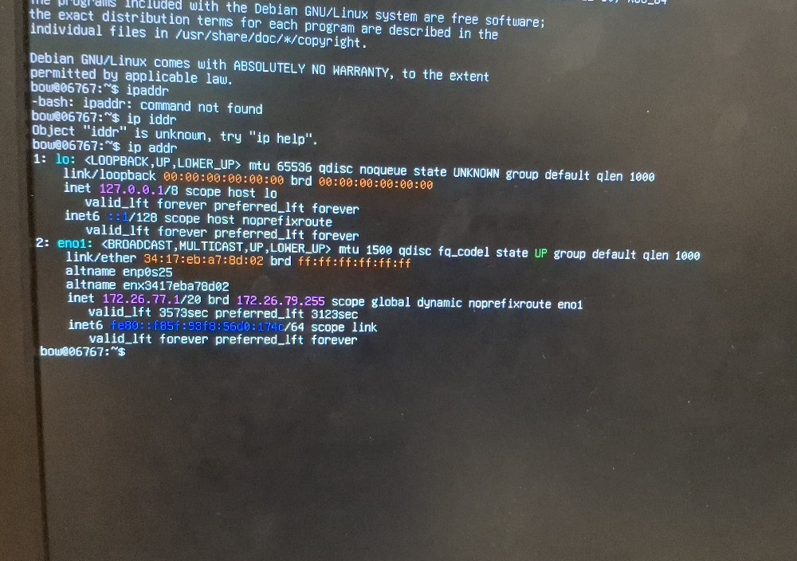

Problem  : Through the last few decades, several data breaches from big companies like google have been discoved, not only that but google is complicit of training their AI bots on the data you store on their cloud and they coud potentialy have acess to your sensible informations. 

Solution  :  You can make your own google drive ;) here, follow me 

# Summary 
[Phase 1 debian install + mirror problem solving](#phase-1)

[[#Phase 2 SSH and tailscale setup]]

[[#Phase 2 formating hard drives + RAID1 with ZFS]]

[[#Phase 3  setting up snaptshots for backup with ZFS and automating them with Sanoid]]

[[#Phase 4 : Allowing users a part of the RAID 1 disk storage]]

[[#Phase 5 : automatizing system updates]]

[[#Phase 6 : hosting Nextcloud on a docker ]]

[[#IMMICH]]

[[#Getting rid of tailscale]]

<a id="phase-1"></a>
### Phase 1 debian install + mirror problem solving

This step is widely documented on the web, so i will skip the documentation and only describe how i solved the problems i've encountered.

#### A mirror problem 

 problem : I couldn't acess debian mirrors all over the world... which means i couldn't acess the usual packages i have to install.. thus no way to install vim, sudo,  or anything, no NOTHING...

solution : since you can't install any packages, because you can't acess mirrors.
BUT i had ethernet, so all i needed to do is go acess the mirror links manually for each package.
let's acess those sources :

``` 
nano /etc/apt/sources.list
```
(nano because vim isnt installed...)

then we add the sources manually : 
you can get those on the official Debian wiki 
this is the old way of doing it :
```
deb http://deb.debian.org/debian/ bookworm main
deb http://security.debian.org/debian-security bookworm-security main
deb http://deb.debian.org/debian/ bookworm-updates main
```
(just copy and paste this) 

and the new way is just a format change, instead of a .list file you use a .sources and write in it:
```
Types: deb deb-src
URIs: https://deb.debian.org/debian
Suites: trixie trixie-updates
## If you want access to contrib and non-free components,
## add " contrib non-free" after "non-free-firmware":
Components: main non-free-firmware
Enabled: yes
Signed-By: /usr/share/keyrings/debian-archive-keyring.gpg

Types: deb deb-src
URIs: https://security.debian.org/debian-security
Suites: trixie-security
Components: main non-free-firmware
Enabled: yes
Signed-By: /usr/share/keyrings/debian-archive-keyring.gpg
```
BOUM now you have all packages :D

don't forget to update : 
```
apt update
apt upgrade
```
i was then able to install vim :) 

-----------------
### Phase 2 : SSH and tailscale setup 
At the time i started this phase, my server was sitting inside my school, plugged in through ethernet. I wanted to be able to work on it from any classroom (aka not be physically connected to the server to work on it). So let's set up our ssh protocol : 
#### first step : Getting my server's ip adress
```
ip addr
```
which gives back : 


![[Pasted image 20260216161805.png]]

. " UP " means i am connected to the internet (thanks to the ethernet cable
. inet 127.26.77.1/20 -> 127.26.77.1 is my ip adress !
#### second step : setting up ssh

```
apt install openssh-server
```

and test it out by connecting from my laptop :

```
ssh bow@172.26.77.1
```
(bow is the user)

#### third step : setting up tailscail

i needed to work on CIRCE even on the weekends, aka when im home home (paris) but if i open my ssh port for the entire internet, it would be a huge security concern. Thus why we install tailscale, which creates a "tunnel" (safe). we will go for an open source version later on when i'll have time to do my research :)-

to install tailscale : 
```
apt update && apt install curl -y
curl -fsSL https://tailscale.com/install.sh | sh
```

once installed, start it up :
```
sudo tailscale up
```

then the terminal will give you an url and you just have to paste that url on your laptop in the browser (where you are ALREADY logged in tailscail)
![[Pasted image 20260216192225.png]]
and bim, it shouls show you the NAS  new ip adress on the website
now you can  ssh into it safely from anywhere :) (from any pc that has tailscale operational)

### Phase 2 inserting hard drives/formating + RAID1 with ZFS

#### 1st step : formating the disks : 
I physically connected two HDD disks of 250gb each, but the NAS isn't picking them up
so, what's up ?

first, run : 
```
sudo fdisk -l
```
-> gives info about the disks onboard

this gave me :

![[Pasted image 20260218105713.png]]

Here we see that debian is installed on my 500gb hdd,  so now let's format (= delete everything) on the two hdd disks i added. ( they are named /dev/sdb and /sdc BE CAREFULL BECASE SDA IS THE DEBIAN DISK DON'T touch it.

to format  : 
```
sudo wipefs -a /dev/sdb
sudo wipefs -a /dev/sdc
```

However, if we run lsblk we notice that there is "sdb2" which means sdb has a partition and it hasnt been erased : 
```
lsblk
```
![[Pasted image 20260218152312.png]]
Not to worry tho, ZFS will take care of erasing the partition when creating the pool.
#### 2nd step : mounting the disks with ZFS + problem solving

to mount the disks,  we need to create a "pool" first using the ZFS tool.  ( ZFS is the new tool that regroups fdisk, mdadm and mkfs.ext4 under the same umbrella)

first install ZFS tool : 
```
sudo apt update
sudo apt upgrade
sudo apt install zfs-dkms zfsutils-linux
```

**problem encountered**
     running this gave me a problem because i configured my debian .sources file to only get free packages. But aparantly ZFS needs the "contrib non-free" tag.  so let's go back to our package .sources : 
     ![[Pasted image 20260218121003.png]]
     we just added "contrib non-free"
    zfs should work now :) 

  Now let's create a storage "pool" for the two 250gb disks. 
  ```
zpool create -f tank mirror /dev/sdb /dev/sdc
  ```
 Altoough i've heard that if you used sda sdb sdc, and then unplugged your drives and changed the order (physically), it would change their names (sda becomes sdb etc..) to avoid this we used to name them by their entire disk id (unique), even if this problem should be solved by modern ZFS, i wnana try the old way so:

let's go to 
```
/dev/disk/by-id/
```
and use : 
```
ls
```

which gives :
![[Pasted image 20260218161242.png]]

here, its written in the name id who is 500 (ST'500'...) for exemple
and also the partition on one of the 250gb disk that wasn't erased
so :
```
zpool create <name of the pool> mirror /dev/disk/by-id/ata-ST3250318AS_5VY5KNNV /dev/disk/by-id/ata-WDC_WD2500AAKX-603CA0_WD-WMAYV3657019
```
which you get by running the following command : 

```
lsblk --nodeps -o name,serial
```

![[Pasted image 20260218153652.png]]
bim now you can use the HDD id instead of its name.

 it worked, and gave : 
 ![[Pasted image 20260218164444.png]]
 uh just know it worked because the part2 is gone, also if you see part1 and part9 idk what it means but its allegedly normal from zfs, search it up i tought it as an automatic partition which it is but the pt9 is for some kind of metadata idk twin look it up im tired ...

bim you got it :))

now you can just open it in your file manager using sftp://your-username@your-server-ip in the path bar :3 BOUMMMM you can just drag and drop files now URGH this awesome you now have a mirrored NAS.

### Phase 3 : setting up snaptshots for backup with ZFS and automating them with Sanoid

By convention : 
Snapshot names consist of the name of the filesystem, followed by an @ and the name of the snapshot. For example, the snapshot snapname of the filesystem filesystem would be filesystem@snapname.

We can list snapshots using the zfs list command and specifying the type as snapshot:
```
zfs list -t snapshot
```
obviously will say "no datasets available" because we didn't take any snapshots yet.
carefull, 
``` zfs list ``` is only to list datasets, won't show the snapshots

anyways let's manually take one : 
```
sudo zfs snapshot Circe_Spellbook@test
```
then re list the snapshots : 

![[Pasted image 20260220095645.png]]
it worked ;)

now write smth in there and lets ROLLBACK :
```
zfs rollback Circe_Spellbook@test
```
worked :)

now let's automate it, obviously you can use zfs built it automation tool except it will give you ZERO power on the frequence of your snapshots or how many to keep etc.. its just install and run, no configuration thus no personalistion.
so let's install Sanoid, which works perfectly with zfs and will use zfs to take snaps and will manage them.

```
sudo apt install sanoid
```
first problem : when i called sanoid ```sanoid``` it said "command not found"

the reason for this is because debian classes some commands such as sanoid as "admin only" which means normal users and idk why but even root do not have acess to it.
To fix that, to fix it instead of switching to root using ```su``` user ``` su -```
uh yeah it works and idk why
to fix:
```
ln -s /usr/sbin/sanoid /usr/local/bin/sanoid
```
instead of using ```su -``` we can also this 

second problem : 
![[Pasted image 20260222161519.png]]

that's normal, its because we haven't set a .conf file so let's do it inside our etc
```
mkdir /etc/sanoid
```

```
vim /etc/sanoid/sanoid.conf
```
fill it with : 
```
[Circe_Spellbook]
	use_template = daily_only
	recursive = yes

[template_daily_only]
	daily = 30
	hourly = 0
	frequently = 0
	monthly = 0
	yearly = 0
	autosnap = yes
	autoprune = yes
```
and then we have to force it manually for the first time so it starts running :
```
sanoid --take-snapshots --verbose
```
let's check if that worked :
```
zfs list -t snapshot
```
also sanoid works on debian by using a counter, which you can see if it is active or not using :
```
systemctl status sanoid.timer
```
which gives : 
![[Pasted image 20260222163607.png]]

### Phase 4 : Allowing users a part of the RAID 1 disk storage

you may have noticed but our RAID 1 storage is in our home, but our users are not inside that space, those are on the RAID 0 storage. To save their files in a safer storage space (raid 1) we can either completly move our user in the RAID 0 storage, OR we could give them acess to a file that points to the RAID1 storage. which means the user could choose which informations are worth saving in the RAID1 space and which ones are pretty much useless (those will be left on the RAID 0) disk.

to make that happen : 
```
# Create the dataset
zfs create Circe_Spellbook/bow

# Give 'bow' full ownership of his new territory
chown bow:bow /Circe_Spellbook/bow

# Restrict it so only 'bow' (and root) can even see the folder
chmod 700 /Circe_Spellbook/bow   (i didnt do this)
```

automating it with sanoid : 
```
[Circe_Spellbook/bow]
    use_template = template_daily_only
    recursive = no
```

now let's create a "portal" so bow can acess that RAID1 Circe_Spellbook/bow_spells from his user account :
```# Create the symbolic link inside bow's home
ln -s /Circe_Spellbook/bow_spells /home/bow/bow_spells
```

now if you tried to write something inside of that safe space for bow user as bow, you will notice you do not have the rights, let's change that.
from what i understood zfs has some wierd stuff that means bow has to first be able to acess Circe_Spellbook, obviously he shouldn't be able to see any other files, only his own that are inside there : 

```
# Allow everyone to "enter" the pool directory (but not necessarily list files)
chmod +x /Circe_Spellbook
```

then : 
```
ls -ld /Circe_Spellbook/bow_spells // to check if bow has permission
```
which retured smth like : drwxr-xr-x 2 root root 2 Mar 20 05:37 /Circe_Spellbook/bow_spells
and "root root" means bow cant do shit, except see
so lets change that : 
```
chown bow:bow /Circe_Spellbook/bow_spells
```
which now gives : drwxr-xr-x 2 bow bow 2 Mar 20 05:37 /Circe_Spellbook/bow_spells
which  is now good :) bow can write and delete there.

Now let's make sure bow doesn't have acess to any of the other files ( she already can't modify them but i dont want her to even be able to go there, i want her to be able to only stay in the space made for her so )

### Phase 5 : automatizing system updates

(remember im a beginner too pls) and from what i've understood there's 3 ways to do this.
1) make the nas send you an email when an update is available and you do it manually or by clicking a button (you write that script too lol)
2) installing the **unattended update package**  of debian ( big con : if at some point zfs will fuck up at adapting to the new updates of your OS (duh its a community mainted thing), and then you'll have to manually save your ass)
3)  OR, big brain option, an **UNFUCKABLE** way to do it, uhh yeah so this sounds HARD core lolzzz ill see that tmr maybe...

### Phase 6 : hosting Nextcloud on a docker 

first step, creating a Containter (we will use the open source Docker product from the Docker company but other products like podman from Redhat exists in open source)
just follow the tutorial on : https://docs.docker.com/engine/install/debian/
the official page for ddebian docker installs.

```
sudo apt upgrade
sudo apt install curl -y

sudo apt remove $(dpkg --get-selections docker.io docker-compose docker-compose-v2 docker-doc podman-docker containerd runc | cut -f1)
```
this is done to fully remove all the old or conflicting versions of docker that could be on ur pc already.
then let's setup Docker's apt repository : 
(this is available oon the ubuntu wiki i believe)
```
# Add Docker's official GPG key:
sudo apt update
sudo apt install ca-certificates curl
sudo install -m 0755 -d /etc/apt/keyrings
sudo curl -fsSL https://download.docker.com/linux/debian/gpg -o /etc/apt/keyrings/docker.asc
sudo chmod a+r /etc/apt/keyrings/docker.asc

# Add the repository to Apt sources:
sudo tee /etc/apt/sources.list.d/docker.sources <<EOF
Types: deb
URIs: https://download.docker.com/linux/debian
Suites: $(. /etc/os-release && echo "$VERSION_CODENAME")
Components: stable
Architectures: $(dpkg --print-architecture)
Signed-By: /etc/apt/keyrings/docker.asc
EOF

sudo apt update
```
then we install the latest version : 
```
 sudo apt install docker-ce docker-ce-cli containerd.io docker-buildx-plugin docker-compose-plugin
```

to verify that the Docker service is running  :
```sudo systemctl status docker```
which gives : 
![[Pasted image 20260328131312.png]]
and : 
```sudo docker run hello-world```
which should give : 
![[Pasted image 20260328131531.png]]

Now we create a file for familly meembers, here i will try to give "jems" some space and create a readable only folder "familly" that nextcloud once installed will be able to use : 
```
sudo zfs create Circe_Spellbook/jems
sudo zfs create Circe_Spellbook/famille
```
( we already saw this earlier for zfs)
then we give autorisation for the nextcloud user to be able to modify these files : 
```
sudo chown -R 33:33 /Circe_Spellbook/jems
sudo chown -R 33:33 /Circe_Spellbook/family
```
to verify : ![[Pasted image 20260328135059.png]]
now lets install nextcloud :

```
mkdir ~/circe-cloud && cd ~/circe-cloud
vim docker-compose.yml
```
there are easier ways to run a container, but creating this yml should be the easiest and most advanced way 
copy pasted this in here :
```
services:
  db:
    image: mariadb:10.6
    restart: always
    command: --transaction-isolation=READ-COMMITTED --binlog-format=ROW
    volumes:
      - nextcloud_db:/var/lib/mysql
    environment:
      - MYSQL_ROOT_PASSWORD=super_secret_root_pass
      - MYSQL_PASSWORD=nextcloud_db_pass
      - MYSQL_DATABASE=nextcloud
      - MYSQL_USER=nextcloud

  app:
    image: nextcloud:latest
    restart: always
    ports:
      - 8080:80
    depends_on:
      - db
    volumes:
      - nextcloud_data:/var/www/html
      # THE "PORTALS" TO YOUR ZFS POOL
      - /Circe_Spellbook/jems:/var/www/html/data/jems_private
      - /Circe_Spellbook/famille:/var/www/html/data/famille:ro
    environment:
      - MYSQL_PASSWORD=nextcloud_db_pass
      - MYSQL_DATABASE=nextcloud
      - MYSQL_USER=nextcloud
      - MYSQL_HOST=db

volumes:
  nextcloud_db:
  nextcloud_data:
```

then : 
```
docker compose up -d
```
inside that folder, this runs the cloud and the -d tells it to run in the background so it can run even if i close the terminal 
![[Pasted image 20260328141417.png]]

check if all fine with : ``` docker compose ps```
![[Pasted image 20260328141522.png]]
and now we just have to type in a browser Circeès ip adress followed by ":8080" which is the port number we gave specifically to Nextcloud.
and bim : ![[Pasted image 20260328142954.png]]
now lets login using the password that is in our .yml file

i got this errror : 
![[Pasted image 20260328145532.png]]
thats allegedly a permission error thing ?
so lets : 
```
# Set ownership for the main data portal
sudo chown -R 33:33 /var/lib/docker/volumes/circe-cloud_nextcloud_data/_data

# Also, double check your ZFS datasets just in case
sudo chown -R 33:33 /Circe_Spellbook/jems
sudo chown -R 33:33 /Circe_Spellbook/famille
```
refresh the page now and you should be able to log in, once in you need to link your zfs datasets by doing so  first : 

Click your user icon (top right) -> Apps.
In the search bar (top right), type External storage support.
Click Download and enable.
fill it in an use 


# IMMICH
# Run these as root/sudo
zfs create Circe_Spellbook/immich
chown -R 1000:1000 /Circe_Spellbook/immich

jems...please dude let's re do this correctly okay ? step by step :)

blablabla on refera ça plus tard correctement. Restons d'abord sur nextcloud oki?


# Getting rid of tailscale

## First step : fixed local ip 

everytime you unplug and plug your nas to the ethernet, it will have a new ip. and if you don't know its ip you can't ssh / remote control it. So let's set a static ip, for this we need to talk to your home router. 

```bash
ip route show
```
it's the adress before the "via"
![[Pasted image 20260411234700.png]]
the adress after "src" is Circe's ip rn, the other idk


now type in a browser http://ip_adress_of_the_router

![[Pasted image 20260411234420.png]]
log in and bim it looks like this for me

now get into "parameters" then "DHCP" then "advanced mode" then "beaux statiques" then add fixed ip, (thus also add Circe's mac adress)
to get MAC adress : 
```bash
ip addr
```
![[Pasted image 20260411235424.png]]
uhhhh so link/ether under the eno1 category is Circe's mac adress.... yeah idk why or how dude cmon i cant do it all gimme a break urgh

Circe local ip : 192.168.1.33
MAC : 34:17:EB:A7:8D:02

## 2nd step : fixed router ip 

The internet provider changes your router's ip adress every x days. so in order to have a domain name that points to your router, your router has to tell the server that handles your domainn name that it changed ip, for this we get the domain name from duck dns and run a ducker with duck dns on it, basically it always checks if it's ip (so the router ip too since its own ip is fixed) and if it did change, it sends duck dns servers a message telling them to now point the domain name to the new  ip of the router :)

So go to duck DNS and bim we got a domain name
![[Pasted image 20260412011330.png]]

then open another dir for DuckDNS to run in a container : 
with the following yml file : 
(found on https://docs.linuxserver.io/images/docker-duckdns/)
here's mine : 
```yaml
services:
  duckdns:
    image: lscr.io/linuxserver/duckdns:latest #found on hub.docker.wiki
    container_name: duckdns
    network_mode: host # This lets the container see Circe public ip, if not it will actually have its own ip inside circe and won"t even be aware of an external world

    environment:
      - PUID=1000
      - PGID=1000
      - TZ=Europe/Paris
      - SUBDOMAINS=circe-nas # Just the name, not the whole URL
      - TOKEN=816798d3-285e-4f6f-9159-7530eb19c76d
      - LOG_FILE=false #optional, basically stop ddns from writing long ass useless log files (allegedly) bcuz its not used either way (those logs)

    restart: unless-stopped

    #i skipped a few optional stuff, just visit https://docs.linuxserver.io/images/docker-duckdns/#read-only-operation if you need the whole stuff ;)
```
then let's run it ```docker compose up -d```


uhhhhhh
06767# docker network create caddy_net
6bb5b76431f6b4aaeb000035b77755add765c28275d051a73dc83dcd8857c453

docker compose up -d for both 

une fois que l'on à ademande une adress ipv4 full stack a free on redemmarre la box ds 30 min puis on redirige les ports dont on a besoin vers notre server :

![[Pasted image 20260412151923.png]]
ip destination should be Circe's ip
Ip source is "toutes"
port de début : 80
same 
same 
commentaire : http

now again with port 443 and https as comment

then 
docker restart caddy
and it should work :)
![[Pasted image 20260412154514.png]]


![[Pasted image 20260412154355.png]]
![[Pasted image 20260412154407.png]]
![[Pasted image 20260412154556.png]]
![[Pasted image 20260412154705.png]]uhhh because of smth about the database password we changed lmao we litteraly just turned off and on a docker ptdrr

![[Pasted image 20260412160725.png]]

its because i had a read only file, i just deleted the read only part and now it comes back to an old errror
# 1. Give the web-user group ownership of your storage
chown -R root:33 /Circe_Spellbook/

# 2. The "Magic" bit: Ensure all future files inherit these permissions
chmod -R 2775 /Circe_Spellbook/


fresh start

_ stop running dockers
_ i created a docker dataset in which i have for each container their yaml file and their databases
_ since nextcloud, immich are not root users (they should never be lol, big sec probs) they have to have acess to the place where you will place their databases and pictures still. so let's give em permission  :
_  yml file 
_ autorisation with this : 
```bash
# for nextcloud to be able to create/delete files 
chown -R root:33 /Circe_Spellbook/nextcloud_files 
# the id number for www-data aka th "user" nextcloud is universally 33

# this means root and group 33 (nextcloud) have full acess, other can't look nor write, and the "2" means that even if a brand new file has been dropped there by root, nextcloud can still acess it
chmod -R 2770 /Circe_Spellbook/nextcloud_files
```

we can check if those changes have been made by doing so : 
```bash
ls -ld /Circe_Spellbook/nextcloud_files
``` 
except idk what that means lol... sorry hehe

POUR IMMICH
meme pas besoin de yaml file 

```bash
# Download the Docker Compose file
wget -O docker-compose.yml https://github.com/immich-app/immich/releases/latest/download/docker-compose.yml

# Download the default .env variable file
wget -O .env https://github.com/immich-app/immich/releases/latest/download/example.env
```
then modify the .env file to modify wher you will drop your pictures
![[Pasted image 20260412211256.png]]
now we just have to setup caddy coreclty so it redirects to immich anytime i type in the right url

i changed domain name so lets do this : 


06767# docker exec --user www-data -it circe-nextcloud-app-1 php occ config:system:set trusted_domains 1 --value="circe-cloud.duckdns.org"
System config value trusted_domains => 1 set to string circe-cloud.duckdns.org
06767# docker exec --user www-data -it [YOUR_CONTAINER_NAME] php occ config:system:set overwrite.cli.url --value="https://circe-cloud.duckdns.org"
docker exec --user www-data -it [YOUR_CONTAINER_NAME] php occ config:system:set overwriteprotocol --value="https"
zsh: no matches found: [YOUR_CONTAINER_NAME]
zsh: no matches found: [YOUR_CONTAINER_NAME]
06767# docker exec --user www-data -it circe-nextcloud-app-1 php occ config:system:set overwrite.cli.url --value="https://circe-cloud.duckdns.org"
docker exec --user www-data -it circe-nextcloud-app-1 php occ config:system:set overwriteprotocol --value="https"
System config value overwrite.cli.url set to string https://circe-cloud.duckdns.org
System config value overwriteprotocol set to string https
06767#


 haha idk 


 immich needs authorisation for files too : 

 chown -R root:root /Circe_Spellbook/IMMICH_cloud_pics
chmod -R 755 /Circe_Spellbook/IMMICH_cloud_pics

and you need to create a network between caddy and immich lol 
```
docker network create caddy_net
```
then adding this to the end of caddy yaml file  : 
```yml
networks:
      - caddy_net
```

and this to the end of immich yaml file : 
```yaml
networks:
  caddy_net:
    external: true
```

it all works :)

# Crowdsec to ban brute force attempts and unfamous ips

first, Crowdsec needs to read caddy logs so they need to share a file : 
```bash
mkdir -p caddy_logs
touch caddy_logs/access.log
chmod 666 caddy_logs/access.log
```

then we also created a crowdsec-config and crowdsec-data into a crowdsec directory inside docker and a aquis.yaml

aquis.yml :
```yaml
# ths to tell crowdsec to go see the logs(the path is like this because its the DOCKER path not my real os one)
filenames:
  - /var/log/caddy/access.log
# this is to tell crowdsec that it will be formated by caddy (idk why we precise this)
labels:
  type: caddy
```

then STAY in the caddy repo, and launch crowdsec
```bash
docker compose up -d crowdsec

#and only then get your api key 
docker exec crowdsec cscli bouncers add caddy-bouncer
```

which gives this : 
```bash
EjAEca/kQIS05nalpjgh/vSSOUmJTgUqZhuafCRbf8I

#JEMS THIS IS A SECRET U IDIOT
``` 

then you just : 
```
docker compose up -d --build
```
